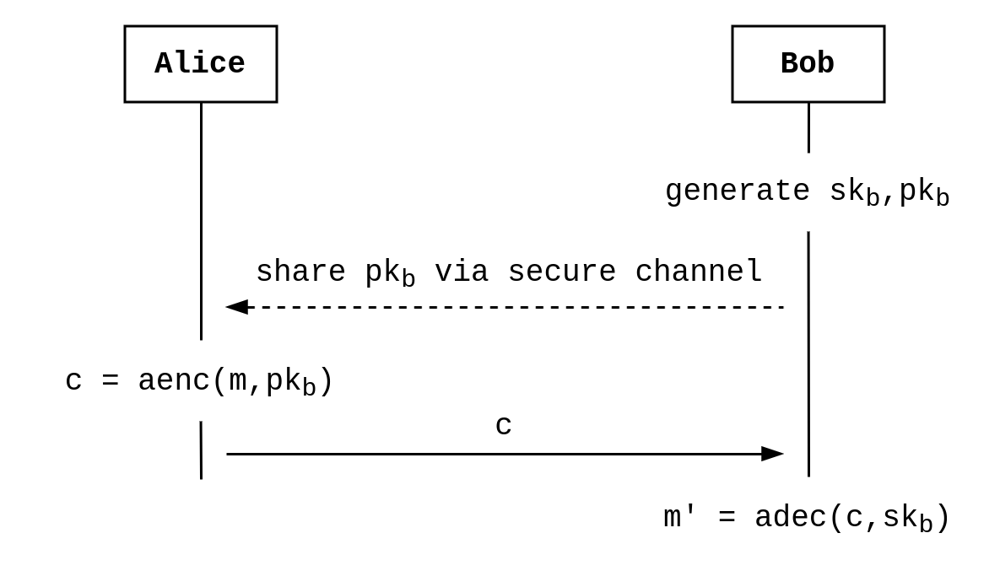
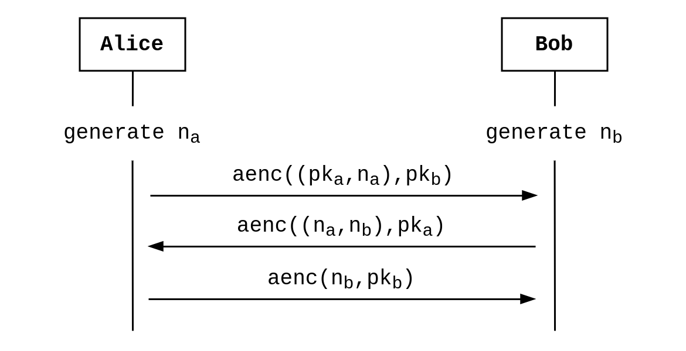
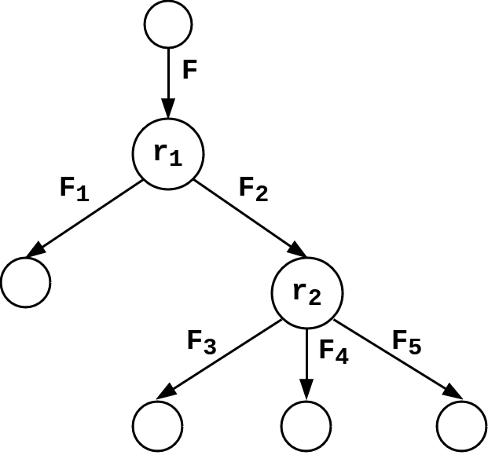

**Note:**
I’m not an expert in the domain, just tried to get a deeper understanding of protocol verification by developing a very basic and incomplete implementation of ProVerif, and I’m sharing my experience here. 
This intro is meant for someone with a software engineer background but no knowledge about formal verification.

> Once upon a time, Alice and Bob were living in a country under a dictatorship and wanted to exchange letters imagining a better government.
> Since they knew that the postman was opening and reading their mail, they needed to conceal the messages.
> Luckily, Alice and Bob had some knowledge in cryptography and managed to exchange their public keys in person, allowing them to encrypt messages with their respective private key. 

**Protocol where Alice uses Bob’s public key to encrypt a message. `aenc` and `adec` stand for asymmetric encryption and decryption, `sk` and `pk` represent a pair of secret and public keys.**



## Why do protocols need to be verified?

The simple (and not very useful...) message exchange above can easily be described with an "Alice-and-Bob" specification.
When looking at the diagram, it is quite clear that an adversary eavesdropping on the communication channel cannot learn the content of the message `m`. Assuming that the adversary doesn’t have access to the secure channel and that [public key cryptography](https://en.wikipedia.org/wiki/Public-key_cryptography) is not broken of course.

But this becomes less obvious when looking at a more complex protocol, like for example the [double ratchet](https://signal.org/docs/specifications/doubleratchet/) used in the [Signal protocol](https://en.wikipedia.org/wiki/Signal_Protocol), which is also used in Whatsapp.
To understand what **security properties** hold or not in this kind of cases, the research field of **protocol verification** formally models protocols and attempts to prove whether certain properties are guaranteed [[Blanchet2012](#Blanchet2012)]. 

## How can protocols be verified?

**Security properties**.
Verifying the secrecy of messages is one thing, but there is actually a variety of properties which can be desirable in a protocol.
For example, Alice might want to make sure that she is indeed getting a message from Bob and not from someone pretending to be him. 
This property is called [authentication](https://en.wikipedia.org/wiki/Mutual_authentication).
Another example I personally encountered is the [verifiability in electronic voting systems](https://eprint.iacr.org/2016/287).

**Modeling protocols**.
Before being able to prove formally the property of a protocol, it needs to be modeled mathematically.
Two main types of models exist, the **computational** model and the **symbolic** model (see [[Blanchet2012](#Blanchet2012)], it’s a good overview of the topic).
We focus here on proofs in the symbolic model, where certain cryptographic primitives are idealized (e.g. encryption is perfect) in order to allow a simpler but deeper analysis.

### Example: modeling Needham Schroeder key exchange with the applied pi calculus
To get a more concrete feeling of what a formal model actually is, let’s look at a simple yet real example: the [Needham-Schroeder](https://en.wikipedia.org/wiki/Needham%E2%80%93Schroeder_protocol) public key protocol, which aims to provide mutual authentication.
This protocol is the classical example in the context of protocol verification, you can for example have a look at section 5.2 of [this tutorial](https://inria.hal.science/hal-01090874v1/file/CK-fntpl-14.pdf) [[Cortier2014](#Cortier2014)].

**The protocol**.
The idea is that Alice and Bob exchange [nonces](https://en.wikipedia.org/wiki/Cryptographic_nonce) (n_a and n_b) encrypted with the public key of the recipient (pk_a and pk_b), which lets make sure that they are indeed communicating with each other.

**Needham Schroeder protocol. The first message is the encryption of the pair (pk_a, n_a), which represent Alice’s public key and nonce, with Bob’s public key. The other messages follow the same pattern.**



**Protocol as processes**.
The issue with the representation above is that some things are left implicit.
For example, what happens if a message is not valid is not defined, or how the nonces are generated either.
To allow the analysis of such a protocol, it has to be first specified using a **precise syntax**.
One such formalization is the **applied pi calculus** [[Abadi2017](#Abadi2017)], where a protocol is modelled as a collection of processes.
Without giving too many details, below are the processes for Alice and Bob executing the Needham Schroeder protocol (see Chapter 5 of [[Cortier2014](#Cortier2014)] for more details).

**The process of an agent in the role of Alice. `out(c,m)` is a function that outputs the message `m` on channel `c`. `pk` is a function that derives a public key from a private one. `fst` and `snd` return the first and second element of a pair, e.g., `snd( (a,b) )` returns `b`.**

```
Pa(ska,pkb) = new(na)
              out(c,aenc((pk(ska),na),pkb))
              in(c,x)
              if fst(adec(x,ska)) = a then
              let nb = snd(adec(x,ska)) in
              out(c,aenc(nb,pkb))
```

**The process of an agent in the role of Bob.**

```
Pb(skb)     = in(c,y)
              let pka = fst(adec(y,skb))
              let na = snd(adec(y,skb))
              new(nb)
              out(c,aenc((na,nb),pka))
              in(c,z)
              if fst(adec(z,skb)) = a then continue
```

When executed in parallel, these two processes run the Needham Schroeder protocol.

## ProVerif

The interest of modeling protocols using a formal model, as we did above using the applied pi calculus, is to analyze them in order to check whether they fullfill some properties.
In this section, we are going to take a look at the [ProVerif](https://bblanche.gitlabpages.inria.fr/proverif/) protocol verifier [[Blanchet2011](#Blanchet2011)] and run a simplified implementation to analyze the Needham Schroeder protocol and detect the [well-known attack by Lowe](https://doi.org/10.1016/0020-0190(95)00144-2).

### Resolution algorithm

The idea is that an attacker, with some limited knowledge (**facts**) and abilities (**rules**), attempts to derive knowledge that should remain secret.
ProVerif verifies whether this is the case or not for a given protocol.
In the case of the Needham Schroeder protocol, an attacker controlling the network should not be able to learn any of the nonces.
What I explain below quite roughly is detailed in Section 2 of [[Blanchet2011](#Blanchet2011)] or in the Section 8.2.6 of the tutorial [[Cortier2014](#Cortier2014)].

**Horn clauses**
ProVerif first converts the protocol into Horn clauses, which we also call rules.
A Horn clause is a logical implication stating that if a set of facts are true, then another is true as well.
For example, the rule `attacker(aenc(m,pk)) and attacker(sk) => attacker(m)` states that an attacker knowing a message encrypted with a public key and the corresponding secret key can learn the plaintext message.
ProVerif then tries to combine the rules and facts available to the attacker to reach a target fact.
If it manages, it means that an attack was found and we say that the target fact is derivable.

**Derivability**
The resolution algorithm of ProVerif works backward: it start from the target and tries to recontruct if from available rules and facts.
To make the process more efficient, a first phase of the algorithm called `saturation` simplifies the set of available rules by combining them.

**Example of derivation tree. The fact F is derivable from the facts F_1, F_3, F4, F_5 using the rules r_1 and r_2.**



### Simplified implementation

**Note:**
In most of my pet projects which stem from interest more than from a need, I often reach a point where I get a bit tired of it.
This is the case now for this post and will stop here for the time being.
If you get here and want to know more about it, feel free to reach out and I might get motivated to finish this properly!

The code is split into files with names explicit enough to link them to the concepts of the research paper.
To start with the higher level code, you should take a look at [Derivation.scala](https://github.com/agoetschm/proto-verif/blob/main/src/main/scala/Derivation.scala).
If you prefer to start with the lower level building blocks, here is a list you can follow.
Again, see [[Blanchet2011](#Blanchet2011)] or [[Cortier2014](#Cortier2014)] for explanations of the concepts.

* [Term](https://github.com/agoetschm/proto-verif/blob/main/src/main/scala/Term.scala): a term is an expression that can be a variable or a function of variables. The definition is recursive, since a term can for example be a function of a fuction.
* [Substitution](https://github.com/agoetschm/proto-verif/blob/main/src/main/scala/Substitution.scala): a substitution is a mapping from variables to terms. It transforms a term into another one by assigning a "value" (which can be any term) to the variables it contains.
* [Unification](https://github.com/agoetschm/proto-verif/blob/main/src/main/scala/Unification.scala): a unifier is a substitution which transforms each term t_i of a set into the same term t.
* [Clause](https://github.com/agoetschm/proto-verif/blob/main/src/main/scala/Clause.scala): a Horn clause, which we also call rule. A protocol is a set of rules, representing the abilities of the attacker to obtain a fact (some knowledge) from other facts.
* [Derivation](https://github.com/agoetschm/proto-verif/blob/main/src/main/scala/Derivation.scala): this file contains the simplified ProVerif derivation algorithm.

### Finding and fixing Lowe's attack

The test file [NeedhamSchroeder.scala](https://github.com/agoetschm/proto-verif/blob/main/src/test/scala/NeedhamSchroeder.scala) contains a representation of the Needham Schroeder protocol in Horn clauses and derives Lowe’s attack.

## References

* [Blanchet2012<a name="Blanchet2012"></a>] B Blanchet. **Security protocol verification: Symbolic and computational models**. International conference on principles of security and trust. 2012. [View](https://inria.hal.science/hal-00863388/file/BlanchetETAPS12.pdf).
* [Cortier2014<a name="Cortier2014"></a>] V Cortier, S Kremer. **Formal Models and Techniques for Analyzing Security Protocols: A Tutorial**. Foundations and Trends in Programming Languages. 2014. [View](http://dx.doi.org/10.1561/2500000001).
* [Abadi2017<a name="Abadi2017"></a>] M Abadi, B Blanchet, C Fournet. **The applied pi calculus: Mobile values, new names, and secure communication**. Journal of ACM. 2017. [View](http://seclab.stanford.edu/pcl/cs259/WWW06/papers/p104-abadi.pdf).
* [Blanchet2011<a name="Blanchet2011"></a>] B Blanchet. **Using Horn clauses for analyzing security protocols**. Formal Models and Techniques for Analyzing Security Protocols. 2011. [View](https://www.researchgate.net/publication/228747656_Using_Horn_Clauses_for_Analyzing_Security_Protocols).
